# Lucida


Lucida is a small project for client-side image correction. A CNN checkpoint predicts brightness, contrast, and saturation values from an input image; the browser runs the ONNX model with ONNX Runtime Web and applies the correction locally with Canvas.

Images are not uploaded for inference. The backend only serves the latest model checkpoint and its config.
When an ORT-format checkpoint exists, the backend serves it before the raw ONNX file to reduce browser runtime load work.
The frontend uses a locally built minimal ONNX Runtime Web WASM runtime generated from `model.required_operators.with_runtime_opt.config`.

## Structure

- `frontend/` - static browser app, image UI, preprocessing, ONNX Runtime Web inference.
- `backend/` - FastAPI service for health checks and checkpoint delivery.
- `ml/` - dataset code, model definition, training script, ONNX export.

## Deploy

Create `.env` from `.env.example`, then run:

```bash
docker compose up --build
```

Default services:

- Frontend: `http://localhost:5173`
- Backend: `http://localhost:8000`

Useful backend endpoints:

- `GET /api/health`
- `GET /api/checkpoint/latest`
- `GET /api/checkpoint/latest/config`
- `GET /api/checkpoint/<model_id>`

The frontend container proxies `/api/*` to the backend using `BACKEND_URL` from `.env`.

## Project Work

Lucida contains three main parts: generated training data, a compact CNN checkpoint, and a browser runtime that runs inference locally and applies a deterministic pixel correction.

## Dataset

Dataset starts from original images and adds synthetic corruption with different severity levels.

- Source data: 2000 original images collected through WikiMediaAPI.
- Processed dataset: 10,000 samples.
- Sample mix: 1,000 original, 2,500 small corruption, and 6,500 high corruption examples.
- Target task: the model does not generate pixels. It predicts correction parameters, then the browser applies them to the source image.

| Small corruption | Medium corruption | High corruption |
| --- | --- | --- |
|  |  |  |

## Model

The model is a compact CNN encoder. It receives a downsampled RGB image plus handcrafted statistics, then predicts brightness, contrast, and saturation.

- Image encoder: downsampled RGB image passes through compact CNN blocks.
- Stats branch: mean, variance, min, and max values add global color context.
- MLP head: predicts brightness, contrast, and saturation parameters.

```mermaid
flowchart LR
    image["RGB image<br/>B x 3 x 256 x 256"]
    stats["stats<br/>B x 18"]
    norm["normalize<br/>(image - 0.5) / 0.5"]

    image --> norm

    subgraph encoder["CNN encoder"]
        direction LR
        l1["Level 1<br/>Conv 3x3 stride 2: RGB 3 to 32<br/>BatchNorm + ReLU<br/>ResidualConvBlock 32<br/>B x 32 x 128 x 128"]
        l2["Level 2<br/>Conv 3x3 stride 2: 32 to 64<br/>BatchNorm + ReLU<br/>ResidualConvBlock 64<br/>add proj r1<br/>B x 64 x 64 x 64"]
        l3["Level 3<br/>Conv 3x3 stride 2: 64 to 128<br/>BatchNorm + ReLU<br/>ResidualConvBlock 128<br/>add proj r1 and r2<br/>B x 128 x 32 x 32"]
        l4["Level 4<br/>Conv 3x3 stride 2: 128 to 192<br/>BatchNorm + ReLU<br/>ResidualConvBlock 192<br/>add proj r1 r2 r3<br/>B x 192 x 16 x 16"]
        l5["Level 5<br/>Conv 3x3 stride 2: 192 to 256<br/>BatchNorm + ReLU<br/>ResidualConvBlock 256<br/>add proj r1 r2 r3 r4<br/>B x 256 x 8 x 8"]
    end

    norm --> l1 --> l2 --> l3 --> l4 --> l5

    p1["pool L1<br/>Linear 32 to 32<br/>r1"]
    p2["pool L2<br/>Linear 64 to 32<br/>r2"]
    p3["pool L3<br/>Linear 128 to 32<br/>r3"]
    p4["pool L4<br/>Linear 192 to 32<br/>r4"]
    p5["pool L5<br/>Linear 256 to 32<br/>r5"]

    l1 --> p1
    l2 --> p2
    l3 --> p3
    l4 --> p4
    l5 --> p5

    p1 -.-> l2
    p1 -.-> l3
    p1 -.-> l4
    p1 -.-> l5
    p2 -.-> l3
    p2 -.-> l4
    p2 -.-> l5
    p3 -.-> l4
    p3 -.-> l5
    p4 -.-> l5

    finalPool["final pool<br/>AdaptiveAvgPool2d 1<br/>flatten: B x 256"]
    concat["concat<br/>final pool B x 256<br/>stats B x 18<br/>r1..r5 B x 160<br/>total B x 434"]

    l5 --> finalPool --> concat
    stats --> concat
    p1 --> concat
    p2 --> concat
    p3 --> concat
    p4 --> concat
    p5 --> concat

    subgraph head["MLP head"]
        direction LR
        h1["Linear<br/>434 to 128"]
        h2["ReLU"]
        h3["Dropout<br/>p = 0.15"]
        h4["Linear<br/>128 to 3"]
    end

    concat --> h1 --> h2 --> h3 --> h4
    neutral["add neutral<br/>0.0 1.0 1.0"]
    output["params<br/>brightness contrast saturation"]
    h4 --> neutral --> output

    classDef inputNode fill:#d9e9ff,stroke:#3577c8,stroke-width:2px,color:#172033;
    classDef conv fill:#def4e7,stroke:#2f8f5b,stroke-width:2px,color:#172033;
    classDef residual fill:#fff0d8,stroke:#c87919,stroke-width:2px,color:#172033;
    classDef headNode fill:#eadfff,stroke:#7957c8,stroke-width:2px,color:#172033;
    classDef outputNode fill:#def4e7,stroke:#2f8f5b,stroke-width:2px,color:#172033;

    class image,stats inputNode;
    class l1,l2,l3,l4,l5 conv;
    class p1,p2,p3,p4,p5,neutral residual;
    class concat,h1,h2,h3,h4 headNode;
    class output outputNode;
```



## App Architecture

- Latest model checkpoint: ONNX file stored as a versioned checkpoint. Frontend asks API for the latest checkpoint when user starts work.
- Backend app: FastAPI delivers model checkpoint and config. It does not run ML inference.
- Frontend app: browser loads the ONNX Runtime Web WASM-only build in a worker, runs the ORT-format checkpoint when available, applies Canvas enhancement in a worker, manages drag and drop, preview, status, cancel, and download.

## License

MIT License. See [LICENSE](LICENSE).
