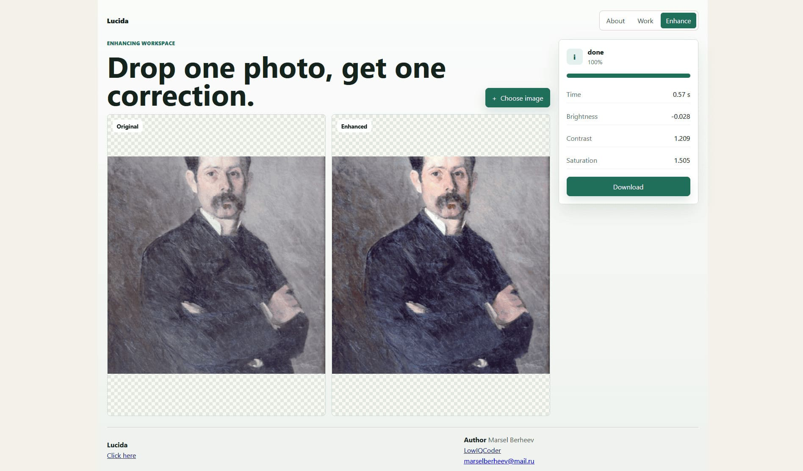

# Lucida



Lucida improves image brightness, contrast, and saturation in the user's browser. A compact CNN predicts correction parameters and application applies them locally. Images are not uploaded to server for inference. Backend only serves model checkpoint and config.

## Features

- Browser-side ML inference with ONNX Runtime Web.
- WASM-only runtime with local minimal ORT artifacts.
- ORT checkpoint preferred over raw ONNX when available.
- Async processing through Web Workers.
- Task API: enqueue, status, cancel, result, release, status events.
- Supports JPG, PNG, BMP, HEIC/HEIF.
- Handles images up to 15 MP.
- Downscaled UI preview to reduce RAM.
- Transferable buffers and `ImageBitmap` to avoid large copies.
- Automatic cleanup of object URLs, workers, task files, and result blobs.

## Processing Flow

1. User presses **Try yourself**; frontend lazy-loads enhancer code and preloads model.
2. Frontend requests latest model config and checkpoint from backend.
3. Model worker runs ONNX Runtime Web with WASM backend.
4. Uploaded image is decoded; HEIC is converted lazily only when needed.
5. Image is resized for model input; RGB tensor and 18 color stats are computed.
6. CNN predicts brightness, contrast, and saturation.
7. Enhancement worker applies correction to full image with `OffscreenCanvas`.
8. Browser returns downloadable JPEG result and releases task memory.

## Structure

- `frontend/` - static app, UI, workers, preprocessing, ONNX Runtime Web inference.
- `backend/` - FastAPI checkpoint/config delivery and health checks.
- `ml/` - dataset tools, model code, training, export, ORT configs.

## Frontend

- `src/main.js` - routes, upload UI, preview, progress, cancel, download.
- `src/lib/enhancer.js` - public task API and lifecycle cleanup.
- `src/lib/model.js` - model worker wrapper and request queue.
- `src/lib/modelWorker.js` - ORT session, checkpoint load, inference.
- `src/lib/preprocess.js` - RGB tensor and image stats.
- `src/lib/enhanceWorker.js` - full-size pixel correction.
- `src/lib/heic.js` - lazy HEIC decoder.

## Model

The model receives a downsampled RGB image and handcrafted RGB statistics. It predicts three values:

- brightness
- contrast
- saturation

The model does not generate pixels. This keeps inference small and lets the browser apply correction to the original image size.

## Dataset

- 2,000 source images from WikiMediaAPI.
- 10,000 processed samples.
- Mix: original, small corruption, high corruption.

| Small corruption | Medium corruption | High corruption |
| --- | --- | --- |
|  |  |  |

## Deploy

First of all initialaze DVC repository and download latest model checkpoint (contact author for DVC access):
```bash
dvc init
dvc remote add -d gdrive gdrive://<your_gdrive_folder_id>
dvc remote modify gdrive gdrive_use_service_account true
dvc remote modify gdrive gdrive_acknowledge_abuse true
dvc remote modify gdrive --local gdrive_service_account_json_file_path path/to/file.json.
```

And pull all data
```bash
dvc pull .\ml\models\
```

Now create `.env` from `.env.example`, then run:

```bash
docker compose up --build
```

Default services:

- Frontend: `http://localhost:5173`
- Backend: `http://localhost:8000`

Backend endpoints:

- `GET /api/health`
- `GET /api/checkpoint/latest`
- `GET /api/checkpoint/latest/config`
- `GET /api/checkpoint/<model_id>`

Frontend proxies `/api/*` to backend with `BACKEND_URL`.

## License

MIT License. See [LICENSE](LICENSE).
