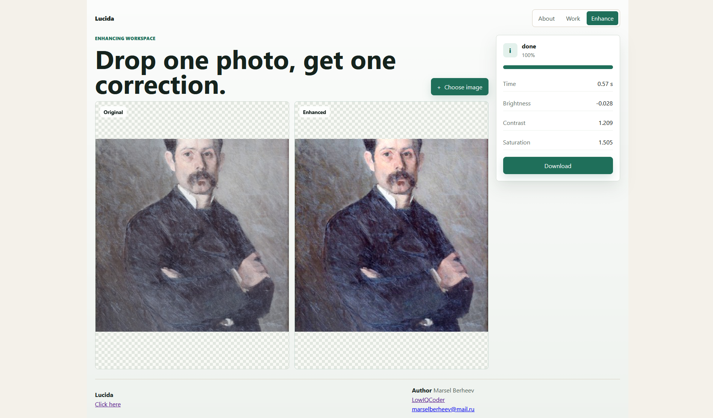

# Lucida



Lucida is a small project for client-side image correction. A CNN checkpoint predicts brightness, contrast, and saturation values from an input image; the browser runs the ONNX model with ONNX Runtime Web and applies the correction locally with Canvas.

Images are not uploaded for inference. The backend only serves the latest model checkpoint and its config.

## Structure

- `frontend/` - static browser app, image UI, preprocessing, ONNX Runtime Web inference.
- `backend/` - FastAPI service for health checks and checkpoint delivery.
- `ml/` - dataset code, model definition, training script, ONNX export.

## Deploy

Create `.env` from `.env.example`, then run:

```bash
docker compose up --build
```

Default services:

- Frontend: `http://localhost:5173`
- Backend: `http://localhost:8000`

Useful backend endpoints:

- `GET /api/health`
- `GET /api/checkpoint/latest`
- `GET /api/checkpoint/<model_id>`

The frontend container proxies `/api/*` to the backend using `BACKEND_URL` from `.env`.

## Dataset

Dataset starts from original images and adds synthetic corruption with different severity levels.

| Small corruption | Medium corruption | High corruption |
| --- | --- | --- |
|  |  |  |

## Model

This project uses simple CNN


## License

MIT License. See [LICENSE](LICENSE).
